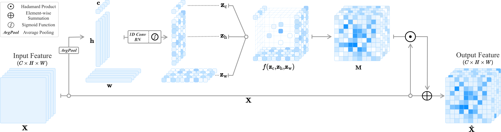

## MoANA: Module of Axis-based Nexus Attention for Weakly Supervised Object Localization and Semantic Segmentation  
<p align="center"></p>

This repository provides the official PyTorch implementation of the following paper:
> **MoANA: Module of Axis-based Nexus Attention for Weakly Supervised Object Localization and Semantic Segmentation**  
> [Junghyo Sohn](https://github.com/JunghyoSohn)<sup>1</sup>, [Eunjin Jeon](https://github.com/eunjin93)<sup>2</sup>, [Wonsik Jung](https://github.com/ssikjeong1/)<sup>2</sup>, [Eunsong Kang](https://github.com/es-kang)<sup>2</sup>, [Heung-Il Suk](https://scholar.google.co.kr/citations?user=dl_oZLwAAAAJ&hl=ko)<sup>1,2</sup>  
> <sup>1</sup> Department of Artificial Intelligence, Korea University, Seoul 02841, Republic of Korea  
> <sup>2</sup> Department of Brain and Cognitive Engineering, Korea University, Seoul 02841, Republic of Korea
>   
> Under review, IEEE Transactions on Image Processing
> 
> **Abstract:** _Although recent advances in deep learning have led to an acceleration in the improvement in weakly supervised object localization (WSOL) tasks, it remains challenging to identify and segment an entire object rather than only discriminative parts of the object. To tackle this problem, corruption-based approaches have been devised, which involve the training of non-discriminative regions by corrupting (erasing) the input images or intermediate feature maps. However, this approach requires an additional hyperparameter, the corrupting threshold, to determine the degree of corruption and can unfavorably disrupt training. It also tends to localize object regions coarsely. In this paper, we propose a novel approach, Module of Axis-based Nexus Attention (MoANA), which helps to adaptively activate less discriminative regions along with the class-discriminative regions without an additional hyperparameter, and elaborately localizes an entire object by utilizing information distributed over widths, heights, and channels with an attention mechanism for calibrating features. Specifically, MoANA consists of three mechanisms (1) triple-view attentions representation, (2) attentions expansion, and  (3) features calibration mechanism. Unlike other attention-based methods that train a coarse attention map with the same values across elements in feature maps, our proposed MoANA trains fine-grained values in an attention map by assigning different attention values to each element in a cost-efficient manner. We validated our proposed method by comparing it with recent WSOL and weakly supervised semantic segmentation (WSSS) methods over various datasets. We also analyzed the effect of each component in our MoANA and visualized attention maps to provide insights into the calibration._

## Dependencies

- [Python 3.6+](https://www.continuum.io/downloads)
- [PyTorch 1.0+](http://pytorch.org/)

## Requirements
```
conda env export > environment.yaml
conda activate research
```

## Dataset

- [ILSVRC](http://www.image-net.org/): 11,788 images from 200 bird categories, divided into 5,994 images for training and 5,794 images for evaluation.
- [CUB-200-2011](http://www.vision.caltech.edu/visipedia/CUB-200-2011.html): 1.2 million images in about 1,000 categories for training and 50,000 images for a validation.
- [Pascal VOC 2012](http://host.robots.ox.ac.uk/pascal/VOC/voc2012/): 21 classes, composed of 1,464 training images, 1,449 validation images and 1,456 test images.

## Code Reference

- Choe et al., [Evaluating Weakly Supervised Object Localization Methods Right](https://github.com/clovaai/wsolevaluation)
- 

## Acknowledge

This work was supported by Institute of Information & communications Technology Planning & Evaluation (IITP) grant funded by the Korea government(MSIT) (No. 2019-0-00079, Artificial Intelligence Graduate School Program(Korea University))
